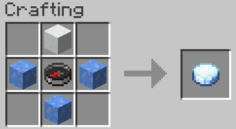
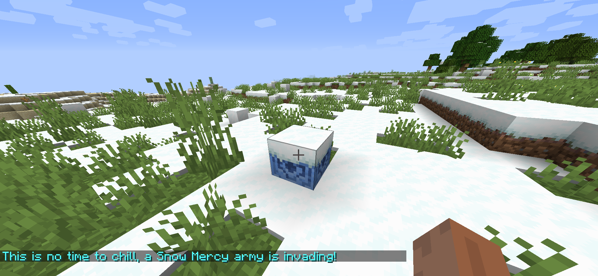

# Snow Mercy

**Snow Mercy** is a Minecraft mod introducing a new event, the Snow Mercy invasion, in which the player can fight off waves of hostile and heavily modified combat snowmen, as well as new mechanics to fight these snowmen and make them your own.

## Video Showcase

https://youtu.be/NDRtmo62U4E

## Getting Started

To start a Snow Mercy invasion, the player can either use a command or a Frozen Compass.

### Commands

- ``/snowmercy start`` will start a Snow Mercy invasion if one isn't already active.
- ``/snowmercy stop`` will stop a Snow Mercy invasion if one is currently active.

### Survival Way

To start a Snow Mercy invasion in survival, the player will need to acquire both a Frozen Compass and a Lodestone. By surrounding a Compass with three pieces of Blue Ice and a Snow Block on top in a crafting table, the player can obtain the Frozen Compass.

After crafting a Frozen Compass, the player can then use it on a Lodestone in order to start a Snow Mercy invasion; this action consuming the compass. The Lodestone will then turn into a Frozen Lodestone, and breaking it will stop the invasion, along with dropping a Lodestone.

## FAQ

#### Can I include this mod in a modpack?

**Yes**: You can. Go ahead, don't bother asking. Please however provide credit and a link to either the GitHub repository or Curse Forge project page.

#### Will you be making a Forge version? Does a Forge version exist?

**No:** I will not be making a Forge version of this mod. The code being GPL3 however, feel free to do a port if you feel like it.